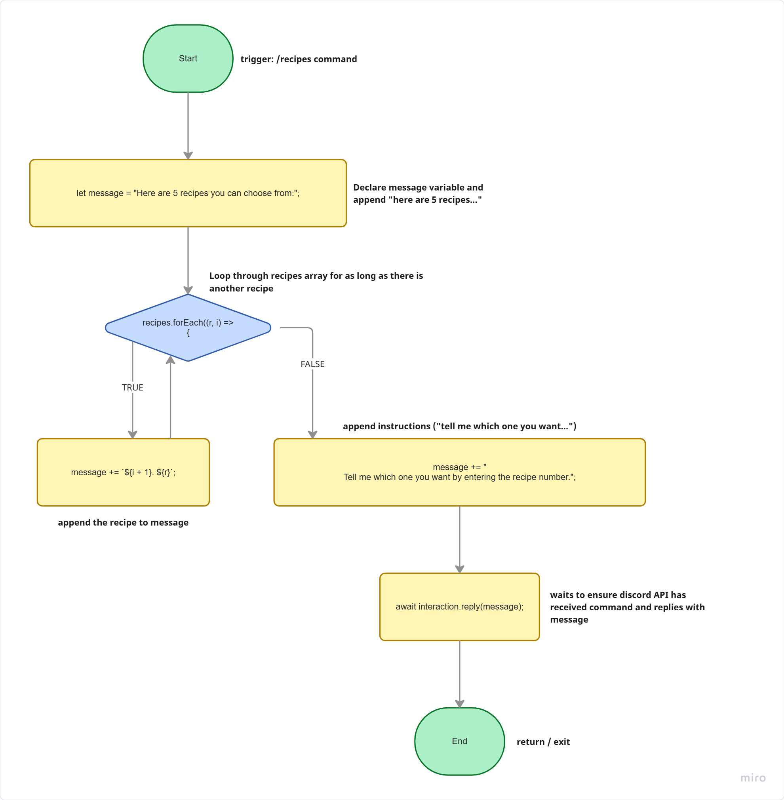
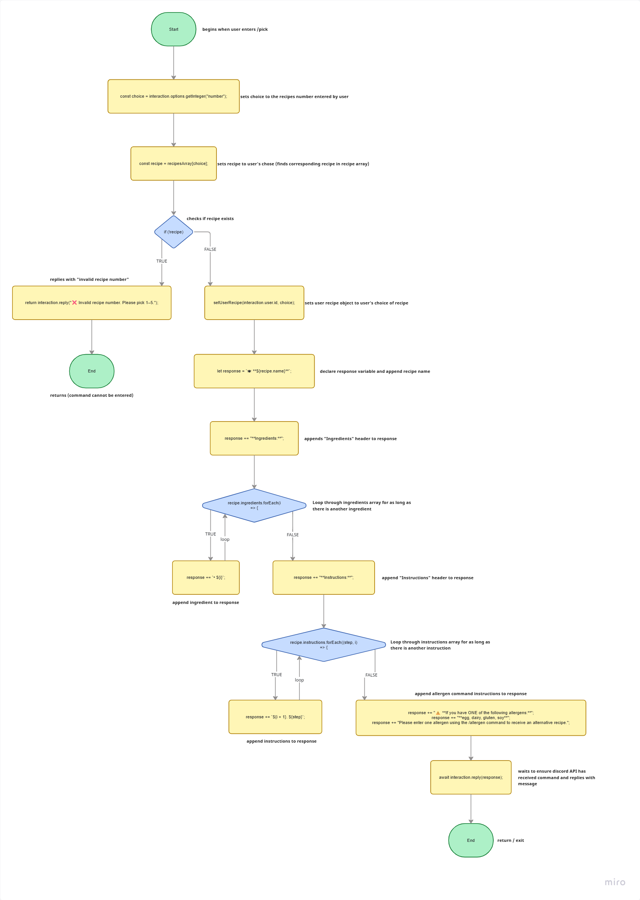
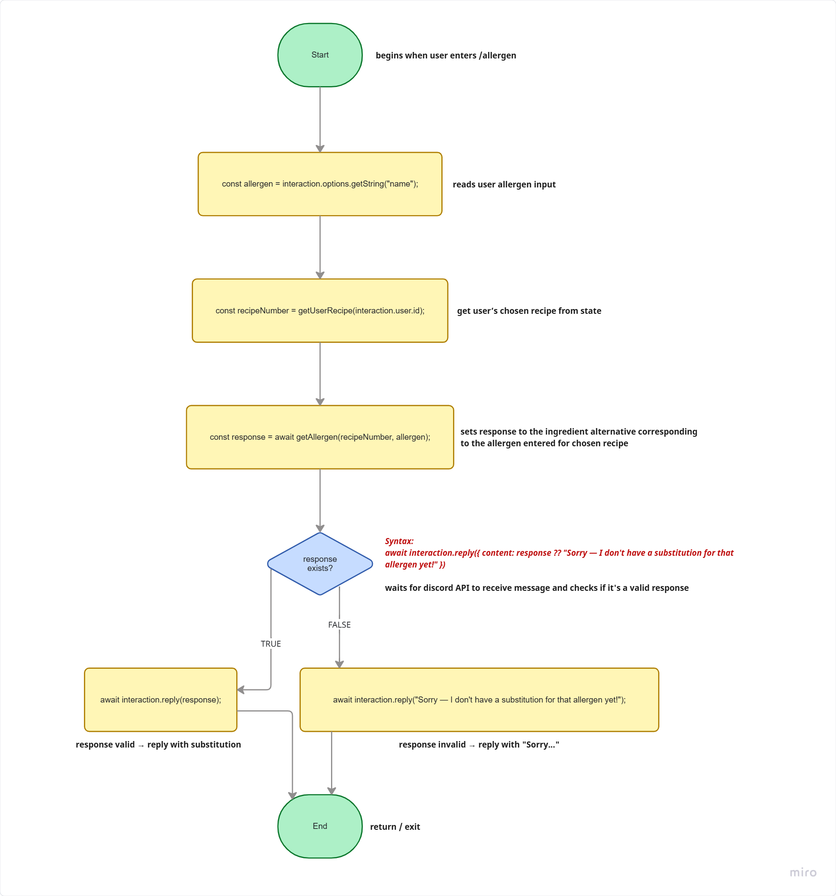

## Architecture Diagram (Network Control Diagram)
## Network Control Diagram

A network flow diagram is a visual representation that indicates the routes over which data travels, the internal and external nodes on which it is stored or processed, and the purpose of those nodes. 

In this case, the flow starts off from a user story of a college graduate to creating options for the user to choose in terms of a recipe to their liking. 

Given the options, they have choices of a bunch of variables like gluten-free, vegan, add-ons, alternatives, and a lot more. 
# Architecture Diagrams 

## Data Flow Diagram

This data flow diagram shows how user commands flow from Discord
into the bot, how recipe selections made by users are processed, how user state is
stored, and how alternative recipes for the stored allergens are generated.

## Control-Flow Graphs
The following three graphs show the possible path traversals for the execute methods for our /recipes, /pick, and /allergens commands respectively.

### 1. Execute (/recipes)

### 2. Execute (/pick)

### 3. Execute (/allergens)

